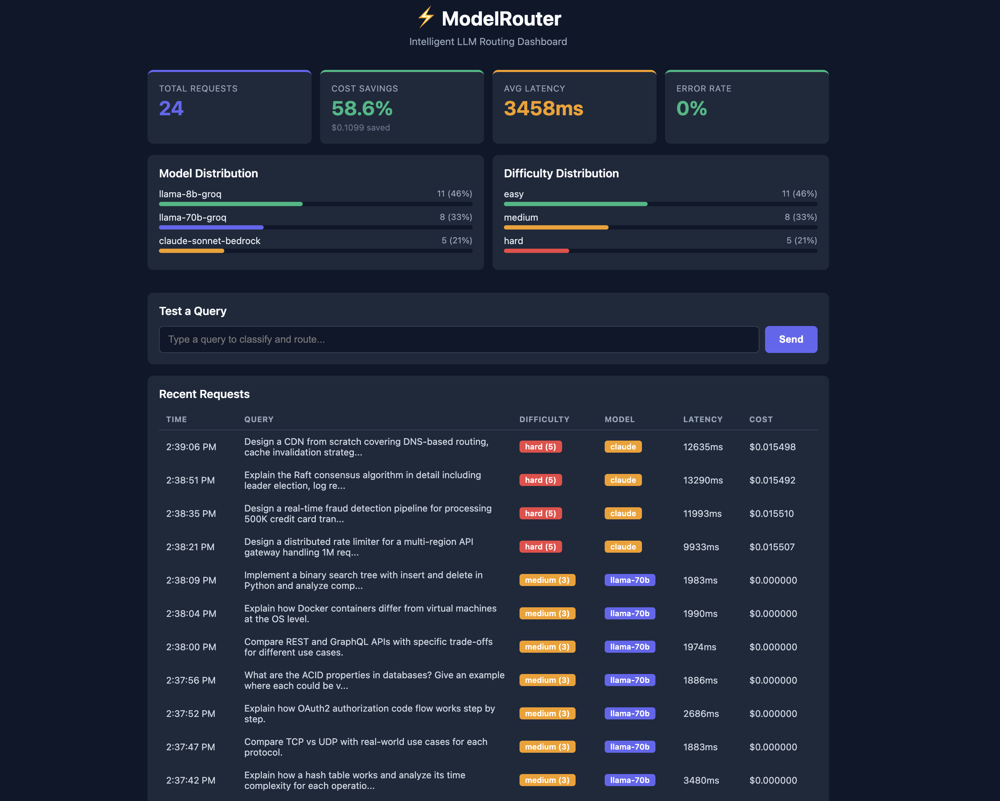

# ModelRouter

An intelligent LLM routing system that classifies query difficulty in real-time and dispatches to the optimal model tier based on difficulty, latency, and cost constraints.



## Architecture

```
User Query → FastAPI Gateway → DistilBERT Classifier → Routing Engine → Model Tier
                                    │                        │
                                    │               ┌───────┼────────┐
                                    │               │       │        │
                                    │           Tier 1   Tier 2   Tier 3
                                    │          Llama 8B  Llama 70B  Claude
                                    │          (Groq)    (Groq)    (Bedrock)
                                    │
                              Response + Metadata → S3 Logs → Dashboard
```

| Tier | Model | Provider | Use Case |
|------|-------|----------|----------|
| 1 (Easy) | Llama 3.1 8B | Groq | Simple Q&A, factual lookups, classification |
| 2 (Medium) | Llama 3.3 70B | Groq | Reasoning, summarization, comparison |
| 3 (Hard) | Claude Sonnet 4 | AWS Bedrock | Complex design, proofs, multi-component systems |

## Key Results

Measured on 24 live queries routed through the deployed system:

| Metric | Value |
|--------|-------|
| Cost savings vs all-Tier-3 baseline | **58.6%** |
| DistilBERT classifier accuracy | **96%** on held-out test set |
| Classifier inference | **~30ms** on CPU (after warmup) |
| Easy query latency (Tier 1) | **~150ms** avg |
| Medium query latency (Tier 2) | **~2.1s** avg |
| Hard query latency (Tier 3) | **~12s** avg |
| Error rate | **0%** |

## How It Works

### 1. Difficulty Classification

Fine-tuned **DistilBERT** (67M params) classifies incoming queries into 4 difficulty classes: trivial, easy, medium, hard. Trained on 671 labeled queries generated via LLM-as-judge (Llama 70B on Groq free tier). Achieves **96% validation accuracy** in ~3 minutes of training on a Colab T4 GPU.

Falls back to a rule-based heuristic classifier if model weights are unavailable.

### 2. Multi-Factor Routing

The routing engine scores each available model using a weighted combination:

```
score = w_quality × quality_estimate(model, difficulty)
      + w_cost × (1 - normalized_cost)
      + w_latency × (1 - normalized_latency)
      + w_success × recent_success_rate
```

Models are filtered by latency budget and cost cap before scoring. For easy queries, all models receive equal quality scores so cost and latency break the tie in favor of smaller, faster models. For hard queries, the quality weight ensures the most capable model is selected.

### 3. Automatic Fallback

If the primary tier fails (rate limit, timeout, error), the system falls back to the next available tier with exponential backoff and retry logic.

### 4. Evaluation Pipeline

Compares routed responses against an all-Tier-3 baseline on 40 gold-standard queries using LLM-as-judge scoring. Outputs a JSON report with per-query quality scores and aggregate metrics. Designed to run as an AWS Lambda triggered by EventBridge.

## Tech Stack

| Component | Technology |
|-----------|-----------|
| API Gateway | FastAPI (Python) |
| Classifier | DistilBERT (fine-tuned, PyTorch) |
| Tier 1–2 Models | Groq API (Llama 8B, 70B) |
| Tier 3 Model | AWS Bedrock (Claude Sonnet 4) |
| Containerization | Docker, docker-compose |
| Deployment | EC2 (t3.micro), ECR |
| Logging | S3 (JSONL) with local file fallback |
| CI/CD | GitHub Actions → ECR → EC2 |
| Dashboard | React (Vite) |
| Evaluation | LLM-as-judge via Groq |

## Project Structure

```
modelrouter/
├── router-api/
│   ├── Dockerfile
│   ├── app/
│   │   ├── main.py              # FastAPI gateway
│   │   ├── classifier.py        # Rule-based classifier (fallback)
│   │   ├── classifier_ml.py     # DistilBERT classifier
│   │   ├── router.py            # Multi-factor routing engine
│   │   ├── logger.py            # Local JSONL logging
│   │   ├── logger_s3.py         # S3 logging
│   │   ├── config.py            # Model registry, weights, thresholds
│   │   └── providers/
│   │       ├── groq.py          # Groq client with retry/backoff
│   │       └── bedrock.py       # AWS Bedrock client
│   ├── model_output/            # Trained DistilBERT weights
│   └── tests/
│       └── test_router.py       # 17 unit tests
├── training/
│   ├── build_dataset.py         # Generate labeled training data via Groq
│   └── train_classifier.py      # Fine-tune DistilBERT (Colab/GPU)
├── eval-pipeline/
│   ├── evaluate.py              # Nightly eval (Lambda-ready)
│   └── gold_queries.json        # 40 gold-standard test queries
├── dashboard/                   # React dashboard (Vite)
├── .github/workflows/
│   └── deploy.yml               # CI/CD: test → build → ECR → EC2
├── docker-compose.yml
└── README.md
```

## Deployment

The system is deployed on AWS:

- **EC2 (t3.micro):** Runs the Dockerized FastAPI gateway with DistilBERT classifier
- **ECR:** Stores Docker images
- **S3:** Stores request logs as JSONL
- **Bedrock:** Provides Claude Sonnet 4 for Tier 3 queries

The CI/CD pipeline (`.github/workflows/deploy.yml`) automates: test → Docker build → push to ECR → deploy to EC2 → smoke test.

## Quick Start

### Prerequisites

- Python 3.12+
- Docker
- Groq API key ([console.groq.com](https://console.groq.com))
- Node.js 18+ (for dashboard)
- AWS account (for Bedrock and deployment)

### Local Development

```bash
git clone https://github.com/shivenkk/modelrouter.git
cd modelrouter
python3 -m venv venv && source venv/bin/activate
pip install -r router-api/requirements.txt

echo "GROQ_API_KEY=your_key_here" > .env

cd router-api
uvicorn app.main:app --reload --port 8000

# dashboard (separate terminal)
cd dashboard
npm install && npm run dev
```

### Docker

```bash
docker compose up --build
```

### API Endpoints

| Endpoint | Method | Description |
|----------|--------|-------------|
| `/route` | POST | Classify, route, and return LLM response |
| `/classify` | GET | Classify difficulty only (no model call) |
| `/stats` | GET | Summary statistics for the day |
| `/logs` | GET | Recent request logs |
| `/models` | GET | Available model configurations |
| `/health` | GET | Health check |

### Example

```bash
curl -X POST http://localhost:8000/route \
  -H "Content-Type: application/json" \
  -d '{"query": "What is 2+2?"}'
```

```json
{
  "response": "2 + 2 = 4.",
  "routing": {
    "difficulty_score": 1.0,
    "difficulty_label": "easy",
    "routed_to": "llama-8b-groq",
    "features": {
      "ml_class": 0,
      "ml_confidence": 0.9734,
      "model": "distilbert"
    }
  },
  "metadata": {
    "model_used": "llama-8b-groq",
    "latency_ms": 83.0,
    "estimated_cost_usd": 0.0
  }
}
```

## Training the Classifier

```bash
cd training
python build_dataset.py --api_key YOUR_KEY --output training_data.jsonl
python train_classifier.py --data training_data.jsonl --output ./model_output --epochs 8
```

## Running Evaluation

```bash
cd eval-pipeline
python evaluate.py \
  --api_url http://localhost:8000 \
  --gold_queries gold_queries.json \
  --groq_key YOUR_KEY \
  --limit 40
```
